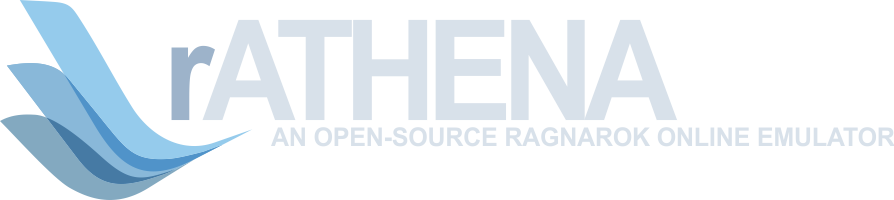
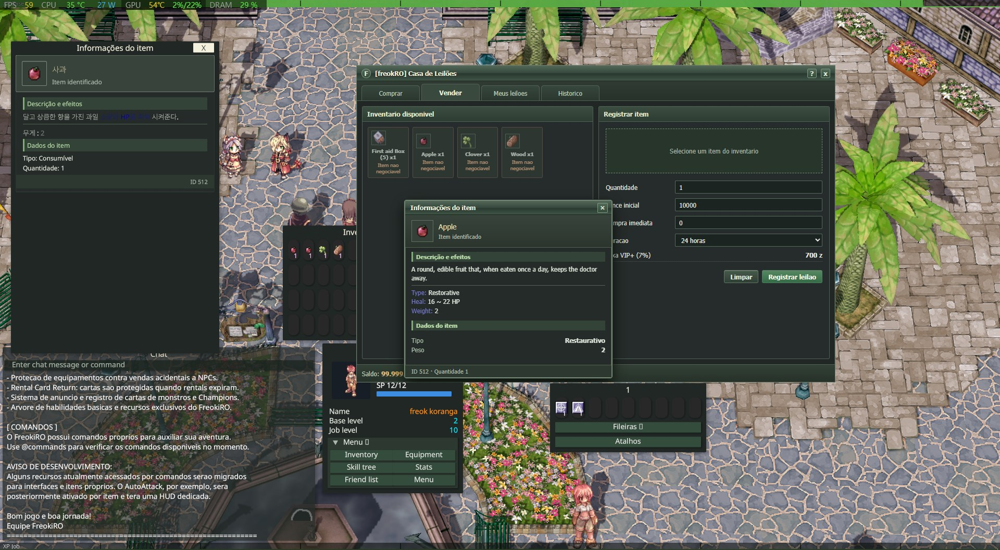
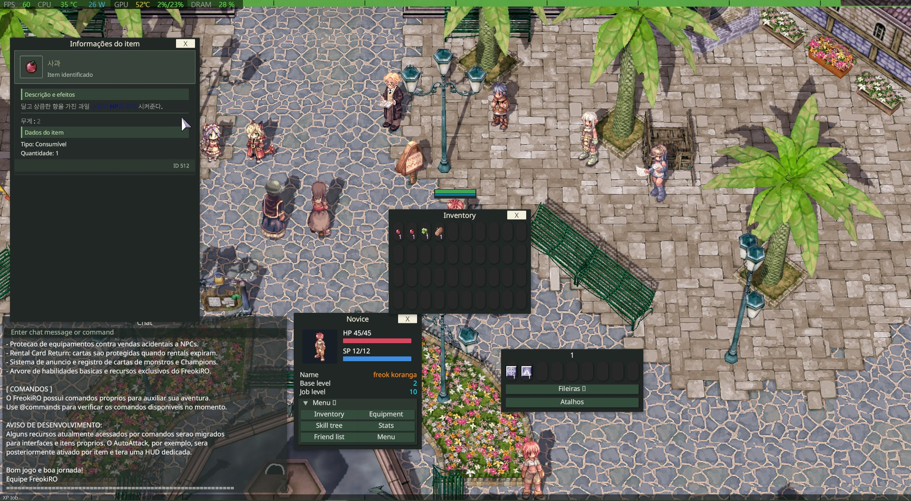

# ⚔️ FreokRO rAthena

## 🧩 FreokRO integration

This fork of [rAthena](https://github.com/rathena/rathena) is adapted to the [FreokRO Korangar client](https://github.com/piabapiaba801/freokro-korangar). The [FreokRO Auction HUD](https://github.com/piabapiaba801/freokro-auction-hud) is a separate **private** project. The base game runs without it; the Black Market window requires it. Protocol and auction changes should be checked across all three repositories.

The FreokRO server repository starts from this local source tree. It has no earlier FreokRO Git base or `main` branch. The linked rAthena project documents the software's origin; it is not an integration base for this repository.

| Component | Integration requirement |
| --- | --- |
| This server | Uses `PACKETVER 20220406` in `src/custom/defines_pre.hpp` and disables packet obfuscation for that version in `src/config/packets.hpp` to communicate with FreokRO Korangar. |
| Korangar client | Depends on this fork's protocol and responses. The original FreokRO Ragexe line uses `20250716` and runs separately. |
| Auction HUD | Depends on the local bridge triggered by **Black Market (7007)** in town. `map-server` validates the session, inventory, Zeny, listings, and bids. |

### 📥 Downloads and Windows requirements

| Purpose | Official dependencies |
| --- | --- |
| Run prebuilt servers | [MariaDB Server](https://mariadb.org/download/) for the `ragnarok` database and [Microsoft Visual C++ Redistributable v14 x64](https://learn.microsoft.com/en-us/cpp/windows/latest-supported-vc-redist?view=msvc-170) for the Windows C++ libraries. The local installation was checked with MariaDB 12.3. |
| Build the server | [Build Tools for Visual Studio](https://visualstudio.microsoft.com/downloads/) with the **Desktop development with C++** workload and Windows SDK. [Git for Windows](https://git-scm.com/install/windows) helps obtain and update the source. |
| Run the full game | Prepare the [FreokRO Korangar client](https://github.com/piabapiaba801/freokro-korangar) and compatible game assets. The Black Market also requires the [private HUD](https://github.com/piabapiaba801/freokro-auction-hud) and its documented dependencies. |

Game assets and database contents are not distributed in these repositories. Use assets from your own installation and import the SQL schema before starting the servers.

### 📸 FreokRO in game

The captures below show the locally running FreokRO client connected to this server on October 7, 2026. They document the client and auction interface together; they do not establish that all auction transactions have passed testing.

*Black Market auction, inventory, and both item description windows.*

*Client inventory and item description with the auction closed.*

### 🏗️ Build and run

On Windows, open `rAthena.sln` and build **Release x64** with Visual Studio Build Tools. Configure the database and local `conf` files in the installation. Deploy `login-server.exe`, `char-server.exe`, and `map-server.exe` with their required configuration. Start the database and servers before the client; start the HUD agent as well for the auction. Installed binaries, database contents, logs, and local credentials are outside this source tree.

### 🛒 Auction schema

The `map-server` bridge and HUD agent share `client/auction-ui/runtime` in the local installation. Apply the migrations under `sql-files/upgrades/` in the appropriate order for an existing database. On October 7, 2026, the local `Failed to start escrow` error was traced to the missing `custom_auction.listing_fee` column. `upgrade_custom_auction_phase5.sql` added it and the `sale_tax` and `seller_net` history fields. An equivalent escrow `INSERT` succeeded inside a rolled-back test transaction, and the user confirmed that escrow subsequently passed in the client. Bidding, buying, cancellation, and item return still need separate checks.

### ✅ Validation

Compilation does not prove every game interaction. Validate login, character selection, skills, respawn, and auction operations with the exact deployed server, client, and HUD combination.

See [TECHNICAL_STATUS_DEV.md](TECHNICAL_STATUS_DEV.md) for the current development checkpoint.

## Upstream rAthena reference

The following badges, project introduction, and general installation notes describe the upstream [rAthena](https://github.com/rathena/rathena) project. They do not report CI results for this FreokRO fork.

 

 
 
 
 

> rAthena is a collaborative software development project revolving around the creation of a robust massively multiplayer online role playing game (MMORPG) server package. Written in C++, the program is very versatile and provides NPCs, warps and modifications. The project is jointly managed by a group of volunteers located around the world as well as a tremendous community providing QA and support. rAthena is a continuation of the eAthena project.

[Forum](https://rathena.org/board)|[Discord](https://rathena.org/discord)|[Wiki](https://github.com/rathena/rathena/wiki)|[FluxCP](https://github.com/rathena/FluxCP)|[Crowdfunding](https://rathena.org/board/crowdfunding/)|[Fork and Pull Request Q&A](https://rathena.org/board/topic/86913-pull-request-qa/)
--------|--------|--------|--------|--------|--------

### Table of Contents
1. [Prerequisites](#1-prerequisites)
2. [Installation](#2-installation)
3. [Troubleshooting](#3-troubleshooting)
4. [More Documentation](#4-more-documentation)
5. [How to Contribute](#5-how-to-contribute)
6. [License](#6-license)

## 1. Prerequisites
Before installing rAthena there are certain tools and applications you will need which
differs between the varying operating systems available.

### Hardware
Hardware Type | Minimum | Recommended
------|------|------
CPU | 1 Core | 2 Cores
RAM | 1 GB | 2 GB
Disk Space | 300 MB | 500 MB

### Operating System & Preferred Compiler
Operating System | Compiler
------|------
Linux  | [gcc-6 or newer](https://www.gnu.org/software/gcc/gcc-6/) / [Make](https://www.gnu.org/software/make/)
Windows | [Visual Studio Build Tools with C++](https://visualstudio.microsoft.com/downloads/)

### Required Applications
Application | Name
------|------
Database | [MariaDB Server](https://mariadb.org/download/) / [MySQL Community Server](https://dev.mysql.com/downloads/mysql/)
Git | [Windows](https://git-scm.com/install/windows) / [Linux](https://git-scm.com/download/linux)

### Optional Applications
Application | Name
------|------
Database | [MySQL Workbench](https://dev.mysql.com/downloads/workbench/)

## 2. Installation 

### Full Installation Instructions
  * [Windows](https://github.com/rathena/rathena/wiki/Install-on-Windows)
  * [CentOS](https://github.com/rathena/rathena/wiki/Install-on-Centos)
  * [Debian](https://github.com/rathena/rathena/wiki/Install-on-Debian)
  * [FreeBSD](https://github.com/rathena/rathena/wiki/Install-on-FreeBSD)

## 3. Troubleshooting

If you're having problems with starting your server, the first thing you should
do is check what's happening on your consoles. More often that not, all support issues
can be solved simply by looking at the error messages given. Check out the [wiki](https://github.com/rathena/rathena/wiki)
or [forums](https://rathena.org/board) if you need more support on troubleshooting.

## 4. More Documentation
rAthena has a large collection of help files and sample NPC scripts located in the /doc/
directory. These include detailed explanations of NPC script commands, atcommands (@),
group permissions, item bonuses, and packet structures, among many other topics. We
recommend that all users take the time to look over this directory before asking for
assistance elsewhere.

## 5. How to Contribute
Details on how to contribute to rAthena can be found in [CONTRIBUTING.md](https://github.com/rathena/rathena/blob/master/.github/CONTRIBUTING.md)!

## 6. License
Copyright (c) rAthena Development Team - Licensed under [GNU General Public License v3.0](https://github.com/rathena/rathena/blob/master/LICENSE)

## Voice Chat
The server-side bridge is prepared for the Sitecraft rathena-voice-chat ecosystem. Configure it in `conf/voice_athena.conf`. The client DLL remains a separate Windows task.
